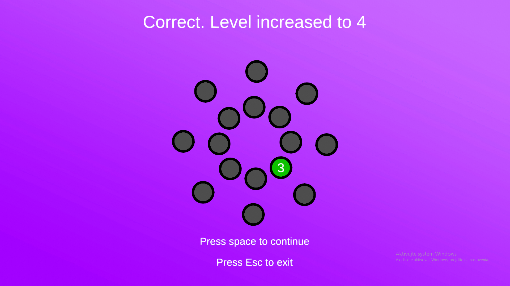
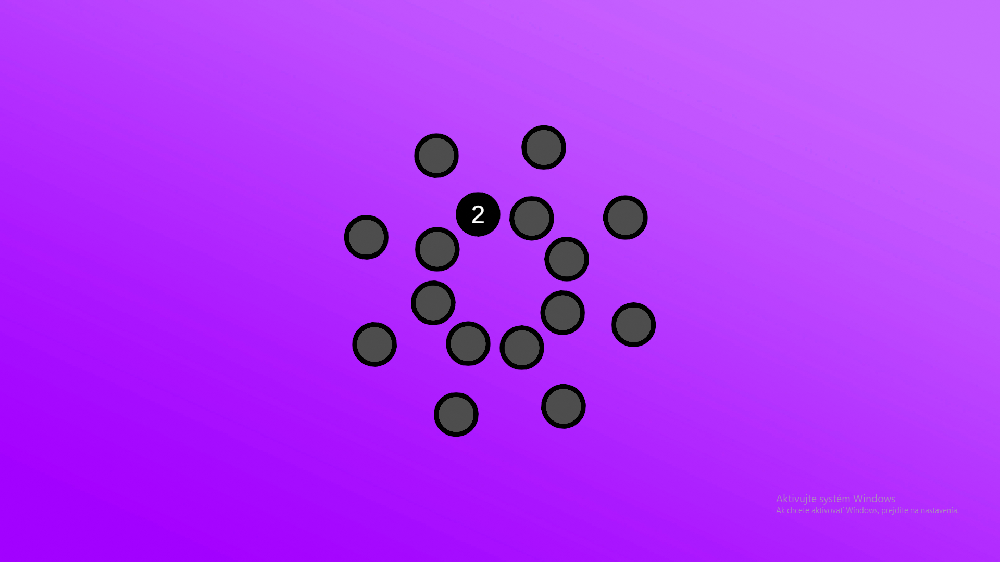

# 🧠 Memory Trainer Game

A simple and customizable memory training game built in Unity using C#.  
Test and improve your memory by clicking on circles in the correct sequence.

## 🎮 Features

- ✅ Click circles in the correct **order** to win
- 🔢 Sequence types: **numbers** or **letters**
- 🔁 Modes:
  - Normal (A → B → C or 1 → 2 → 3)
  - Backward (Z → Y → X or 9 → 8 → 7)
  - Random
- ⚙️ Customizable settings:
   - Number of wheels
   - Speed
   - Letters or numbers
   - Sequence mode

## 📦 Download

➡️ [Download the Game](https://limewire.com/d/bGdxg#cnv4mc9rcX)

## 📸 Screenshots

  

## 🛠️ Built With

- Unity
- C#
